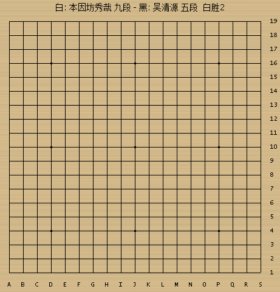

# sgf2gif

Convert SGF Go, Renju records to GIF animations (SGF围棋,连珠五子棋谱转GIF动图工具).

Currently support Windows platform only, it is a `VisualStudio` project.

Some of the source code and documents use GBK encoding.

## Sample outputs

# 备注

目前只用中文棋谱测试过, 而且很久没有编译了, 因为我手头并没有 `VisualStudio`.
不过按理来说在新版里编译也不该有问题, 有条件的朋友可以试一下.
